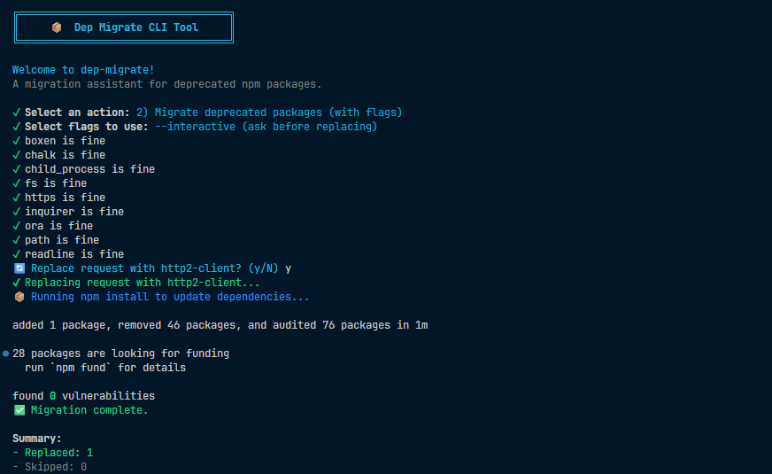

## Overview

**Dep Migrate** is a CLI tool that helps developers migrate away from deprecated or outdated **packages** with ease. It scans your project dependencies, identifies deprecated packages, and suggests modern replacements.

## Features

* **Detect deprecated packages** in your `package.json` or installed `node_modules`.
* **Suggest alternatives** based on community-maintained mappings.
* **Automatically updates** `package.json` and installs replacements.
* **Migration report** summarizing changes made.
* **Safe mode** to preview updates without modifying your project.

## Installation

```bash
npm install -g dep-migrate
```

## Usage

Run `dep-migrate` inside your project directory. This will start the CLI and open the interactive menu.

Follow the on-screen prompts to check for deprecated packages or migrate them to their replacements.

## Example

Suppose your project uses a deprecated package like `request`. From the menu, choose:

```
2) Migrate deprecated packages (with flags)
```

And it will automatically replace `request` with `node-fetch` in `package.json` and reinstall dependencies.

## Contributing

* Add new replacement mappings.
* Improve detection logic.
* Suggest new features.

Fork the repo and open a pull request.
